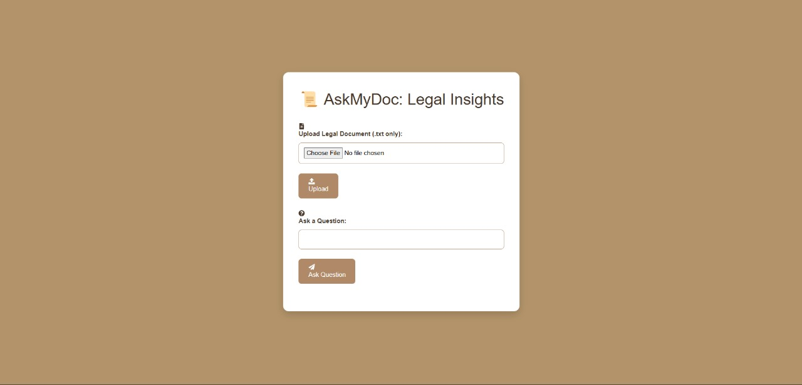

# Law AI Project

  
*Revolutionizing Legal Document Management with AI*

---

## 🚀 **Overview**
**Law AI Project** is a cutting-edge platform designed to empower both lawyers and users with advanced legal document management and AI-driven tools. Whether you're a legal professional or someone in need of legal assistance, Law AI Project simplifies legal processes, making them more efficient, organized, and accessible.

---

## ✨ **Key Features**

### 1. **Dashboard Access**
- **Sign Up & Get Started**: Access the dashboard to generate legal documents in minutes.
- **Query-Based Document Generation**: Enter a query (e.g., "Generate a rental agreement"), and the platform creates a document tailored to your needs. Input personal details like city, phone number, etc., and watch them seamlessly integrate into the document.

### 2. **Chat with PDF**
- **Upload & Interact**: Upload any legal document and ask questions directly from the document. Get instant answers and insights without manually sifting through pages.
- **Smart Legal Assistance**: Understand contracts, agreements, and more with AI-powered insights.

### 3. **Draft Management**
- **Organized Document Storage**: All created documents are stored with names, upload dates, and times.
- **Search & Download**: Easily search for documents by name and download them whenever needed.

---

## 🎥 **Demo Video**
Watch this short video to see Law AI Project in action:

[![Law AI Demo Video]](<video controls src="assets/Video_law.mp4" title="Demo Video"></video>)  
*Click the image above to watch the demo.*

---

## 🛠️ **How It Works**

### Step 1: Sign Up & Access Dashboard
- Create an account and log in to access the dashboard.

### Step 2: Generate Legal Documents
- Enter your query (e.g., "Generate a rental agreement").
- Input personal details, and the document will be generated with your details integrated.

### Step 3: Chat with PDF
- Upload any legal PDF.
- Ask questions and get instant answers.

### Step 4: Manage Your Drafts
- View, search, and download all your created documents in one place.

---

## 📸 **Screenshots**

### Dashboard
  
*Your central hub for all activities.*

### Document Generation
  
*Generate custom legal documents in minutes.*

### Chat with PDF
  
*Get instant insights from your legal documents.*

### Draft Management
  
*Organized and efficient document storage.*

---

## 🚀 **Why Choose Law AI Project?**
- **Efficiency**: Save time with quick document generation and instant PDF insights.
- **Organization**: Keep all your legal documents in one place, neatly organized and easily accessible.
- **User-Friendly**: Designed for both lawyers and users, the platform is intuitive and easy to use.
- **AI-Powered**: Leverage the power of AI to simplify complex legal processes.

---

## 📂 **Project Structure**